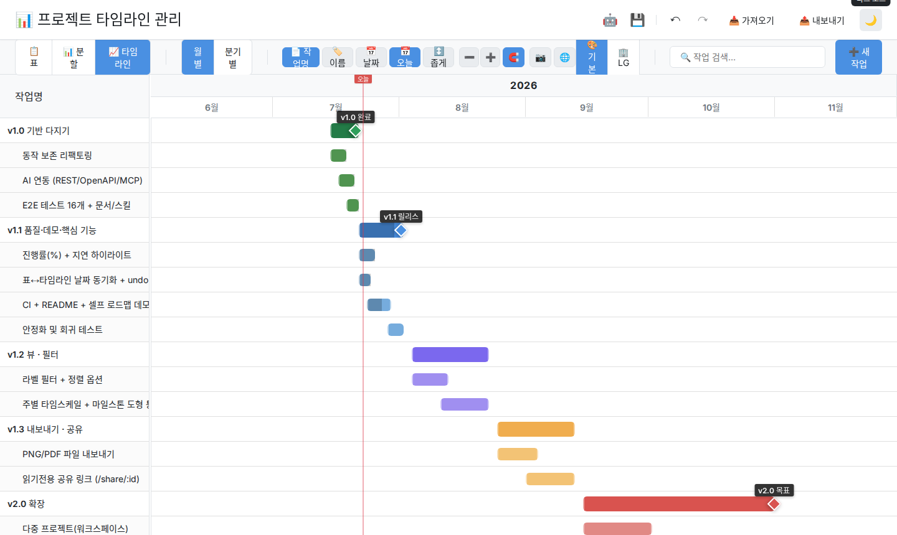

<p align="center">
  
</p>

<p align="center">
  <a href="https://github.com/seongmock/ProjectHelper/actions/workflows/ci.yml"></a>
  
  
  
</p>

# 프로젝트 타임라인 관리 도구

React 기반의 인터랙티브한 프로젝트 타임라인 및 간트 차트 관리 도구입니다.

<p align="center">
  
</p>
<p align="center"><sub>↑ 이 도구로 그린 이 프로젝트 자신의 로드맵 (셀프 데모) · <a href="docs/screenshots/demo-dark.png">다크 모드 보기</a></sub></p>

## 🎯 주요 기능

- **📋 표 형태 리스트 뷰**: 계층적 작업 구조, 인라인 편집
- **📊 간트 차트 타임라인**: 드래그로 날짜 조정, 월별/분기별 뷰
- **🤖 AI 프롬프트 가이드**: 이미지/텍스트 기반 일정 생성을 위한 최적화된 프롬프트 제공
- **📷 이미지 캡처/복사**: 타임라인을 이미지로 클립보드 복사 (HTTP에선 다운로드)
- **🔗 작업 의존성**: S자 곡선으로 선행/후행 작업 시각화
- **🎨 커스터마이징**: 색상, 레이블, 마일스톤 마커, 작업 구분선
- **🖱️ 컨텍스트 메뉴**: 작업명 및 타임라인 바 우클릭으로 빠른 설정
- **💾 저장 시스템**: 이름 지정이 가능한 멀티 슬롯 저장 및 로드
- **⚡ 실행 취소/다시 실행**: 최근 20개 액션 기록
- **📤 가져오기/내보내기**: JSON 백업, **HTML(인터랙티브)** 내보내기
- **⌛ 멀티 타임라인**: 하나의 작업에 여러 개의 기간(Time Ranges) 추가 및 개별 관리
- **🏷️ 라벨 옵션**: 바 라벨(이름)과 날짜 표시를 개별적으로 제어 가능
- **📈 진행률 표시**: 작업별 진행률(%) 슬라이더 + 바 채움 오버레이
- **⚠️ 지연 하이라이트**: 종료일이 지난 미완료 작업 자동 경고 표시
- **🌙 다크 모드**: 라이트/다크 테마 지원
- **🤖 AI 연동 (REST/MCP)**: AI 에이전트(Claude Code 등)가 일정을 직접 조회/수정 — 열린 브라우저에 10초 내 자동 반영 ([docs/AI_INTEGRATION.md](docs/AI_INTEGRATION.md))
- **⌨️ 키보드 단축키**: Ctrl+Z, Ctrl+Y, Ctrl+S 등

> 🗺️ 개발 계획: [ROADMAP.md](ROADMAP.md) — 이 로드맵은 앱 자체에 간트 차트로 주입되어 있습니다 (셀프 데모)

## 🚀 시작하기

### 배포 (Docker Compose + HTTPS)

Caddy가 HTTPS(자체 서명 인증서)와 Basic 인증을 처리합니다.

```bash
# 1) 인증 정보 설정 (최초 1회)
cp .env.example .env
docker run --rm caddy:2.10-alpine caddy hash-password --plaintext '원하는비밀번호'
#   → 출력된 해시를 .env 의 BASIC_AUTH_HASH 에 넣고, BASIC_AUTH_USER 도 지정

# 2) 배포 (실행 전 자동으로 데이터 백업 → 빌드 → 헬스체크)
./start_server.sh

# 3) 배포 검증
./scripts/verify-deploy.sh
```

> Docker를 쓸 수 없으면 자동으로 로컬 Node 정적 서빙(HTTP:8080)으로 폴백합니다.
> 이 폴백 모드에는 **인증도 API 서버도 없습니다** — 임시 확인용으로만 쓰세요.

> 브라우저에서 "안전하지 않음" 경고가 뜨면 `고급 → 무시하고 진행`을 누르세요.
> (자체 서명 인증서라 정상입니다. HSTS는 의도적으로 끄고 있습니다 — 켜면 이 우회가 막힙니다.)

### 개발 모드 (Hot-Reload)
```bash
./start_server.sh --dev
```

### 수동 실행 (Node.js)
```bash
npm install
npm install --prefix server

PORT=3100 npm run dev:api &                        # API 서버 (저장 동기화·AI 연동)
VITE_API_TARGET=http://localhost:3100 npm run dev  # 프론트엔드
```
브라우저에서 http://localhost:5173 접속

> 포트 3000이 다른 서비스에 점유돼 있으면 위처럼 `PORT` / `VITE_API_TARGET` 을 맞춰주세요.

### 데이터 백업 / 복원
```bash
./scripts/backup-data.sh                 # 즉시 백업 (무결성 검증 포함)
./scripts/backup-data.sh --install-cron  # 매일 03:00 자동 백업 등록
./scripts/backup-data.sh --list          # 백업 목록
./scripts/backup-data.sh --restore <아카이브>
```

### 테스트
```bash
npm run lint         # ESLint
npm run test:unit    # 단위 테스트 (도메인 순수함수 + XSS 회귀)
npm run test:server  # 서버 테스트 (검증 로직 + 저장소 내구성)
npm run test:e2e     # Playwright E2E 36건 (API·dev 서버 자동 기동)
npm run verify       # 위 전부 + 빌드
```

### 프로덕션 빌드
```bash
npm run build
```

## 🛠️ 기술 스택

- **React 18** - UI 프레임워크
- **Vite 6** - 빌드 도구
- **Vanilla CSS** - 스타일링
- **Express** (`server/`) - JSON 파일 영속화 + REST API
- **localStorage** - 오프라인 캐시 (서버 장애 시 폴백)
- **Caddy** - HTTPS 리버스 프록시 + Basic 인증
- **Playwright / Vitest / node:test** - E2E 36건 + 단위 264건(unit 167 + server 97)

## 📖 사용법

1. **새 작업 추가**: "➕ 새 작업" 버튼 클릭 또는 `Ctrl+N`
2. **작업 편집**: 작업명 더블클릭하여 수정
3. **날짜 조정**: 타임라인에서 바를 드래그
4. **하위 작업**: 각 작업의 ➕ 버튼으로 하위 작업 추가
5. **뷰 전환**: 도구 모음에서 표/타임라인/분할 뷰 선택

## ⌨️ 키보드 단축키

- `Ctrl+Z` - 실행 취소
- `Ctrl+Y` - 다시 실행
- `Ctrl+S` - JSON 내보내기
- `Ctrl+N` - 새 작업 추가
- `↑` / `↓` - 작업 선택 이동 (선택이 없으면 첫/마지막 작업)
- `[` / `]` - 선택한 작업의 일정을 하루 앞/뒤로
- `Shift+[` / `Shift+]` - 일주일 단위로 이동
- `Alt+[` / `Alt+]` - 종료일만 조정 (기간 줄이기/늘리기)


## 📝 라이선스

MIT License

## 👤 작성자

seongmock
